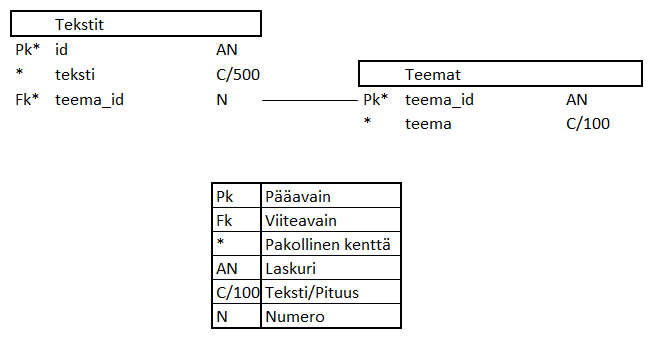

# greeting-card-texts-api

Api-palvelin, joka on toteutettu Node.js Express-sovelluskehyksellä. Tietokantajärjestelmänä toimii PostgreSQL.

## Tietokanta



> ### _Tekstit_
> _Tekstit-taulu sisältää tervehdystekstit._
>
> Kenttä | Tyyppi | Kuvaus
> ------ | ------ | ------
> id | int PK | Tekstin id
> teksti | varchar(500) |  Tervehdysteksti
> teema_id | int FK | Tekstin teema, viittaus [teemat](#Teemat)-tauluun

> ### _Teemat_
> _Teemat-taulu sisältää tervehdysteksteihin liittyvät teemat._
>
> Kenttä | Tyyppi | Kuvaus
> ------ | ------ | ------
> teema_id | int PK | Teeman id
> teema | varchar(100) |  Teema

## Rajapinnan kuvaus

> Metodi | Url | Vastaus
> ------ | ------ | ------
> GET | api/v1/teemat | Hakee kaikki teemat (HTTP 200 OK TAI 404 not found)
> GET | api/v1/teemat/:id/tekstit |  Hakee samaan teemaan kuuluvat tekstit (HTTP 200 OK TAI 404 not found)
> POST | api/v1/teemat | Lisää uuden teeman (HTTP 201 luotu teema tai 422 virheet)
> GET | api/v1/tekstit | Hakee kaikki tekstit (HTTP 200 OK TAI 404 not found)
> GET | api/v1/tekstit/:id | Hakee tekstin id:llä (HTTP 200 OK TAI 404 not found)
> POST | api/v1/tekstit | Lisää uuden tekstin (HTTP 201 luotu teema tai 422 virheet
> PUT | api/v1/tekstit/:id | Muokkaa tekstiä (HTTP 200 OK ja muokatun tekstin id tai 500)
> DELETE | api/v1/tekstit/:id | Poistaa tekstin (HTTP 200 OK ja poistetun tekstin id tai 500)

## Asennustiedot

### Järjestelmän kehitysympäristö

Lataa ja asenna [Git](https://git-scm.com/downloads), [VisualStudioCode](https://code.visualstudio.com/), [PostgreSQL](https://www.postgresql.org/download/) ja [Node](https://nodejs.org/en/download/)

Kloonaa projekti:
```
git clone https://github.com/marhyvar/greeting-card-texts-api.git
```
```
cd greeting-card-texts-api
```
Asenna riippuvuudet:
```
npm install
```

 PostgreSQL-tietokantapalvelimelle otetaan yhteys [psql-terminaaliohjelman](http://www.postgresqltutorial.com/connect-to-postgresql-database/) avulla ja luodaan käyttäjä, salasana tälle käyttäjälle, tietokanta sekä käyttäjälle oikeudet tietokantaan.
 - `CREATE ROLE <nimi> WITH LOGIN PASSWORD 'password';`
- `ALTER ROLE <nimi> CREATEDB;';`
- `CREATE DATABASE <tietokannan_nimi>;`
- `\c <tietokannan_nimi>` (otetaan yhteys tietokantaan)

Tietokanta luodaan init.sql -tiedoston mukaisesti, tarkemmat ohjeet [täällä](https://www.postgresql.org/docs/10/tutorial-start.html) ja [täällä](https://blog.logrocket.com/setting-up-a-restful-api-with-node-js-and-postgresql-d96d6fc892d8/).

.env -tiedosto, joka ei mene versionhallintaan, paikallisia ympäristömuuttujia varten:
```
DB_USER=nimi 
DB_PASSWORD=password 
DB_HOST=localhost
DB_PORT=5432
DB_DATABASE=tietokannan_nimi 
```

Käynnistä palvelin:
```
node index.js
```
Ja avaa selaimessa http://localhost:3002

### Tuotantoympäristöön (Herokuun) julkaiseminen

Hanki [Heroku-tili](https://signup.heroku.com/) ja lataa sekä asenna [Heroku-CLI](https://devcenter.heroku.com/articles/heroku-cli). Tarkemmat ohjeet Node-projektien julkaisemisesta [täällä](https://devcenter.heroku.com/articles/getting-started-with-nodejs)

Luo uusi projekti Herokuun. Provisioi projektille [PostgreSQL-tietokanta](https://elements.heroku.com/addons/heroku-postgresql), tarkemmat ohjeet [täällä](https://devcenter.heroku.com/articles/getting-started-with-nodejs#provision-a-database). Kirjaudu Herokun PostgreSQL:ään ja luo sinne tietokanta init.sql -tiedoston mukaisesti
```
heroku pg:psql <postgresql-instanssin-nimi> --app <heroku-sovelluksen-nimi>
```
Postgresql-instanssin nimen löydät komennolla
```
heroku addons
```
Lopuksi pushaa koodi Herokuun:
```
git push heroku master
```

### Lähteet

[Setting up a RESTful API with Node.js and PostgreSQL](https://blog.logrocket.com/setting-up-a-restful-api-with-node-js-and-postgresql-d96d6fc892d8/)

[Create and deploy a Node.js, Express, & PostgreSQL REST API](https://www.taniarascia.com/node-express-postgresql-heroku/)

